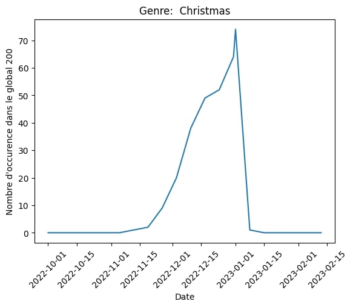
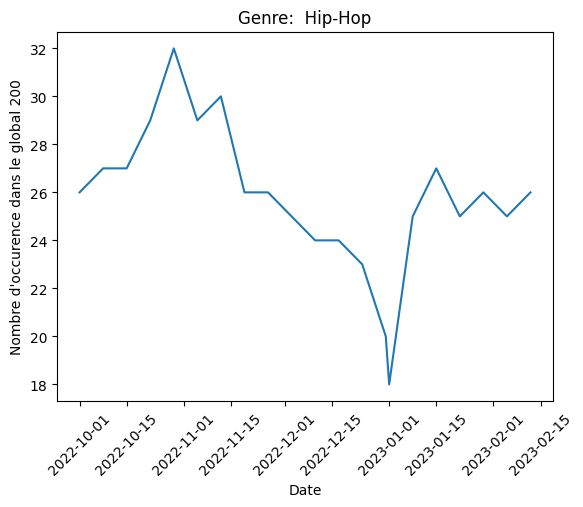
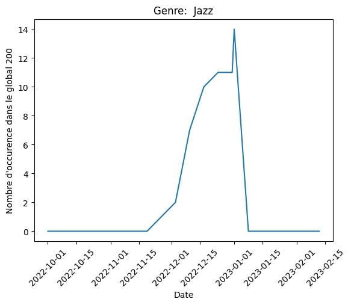
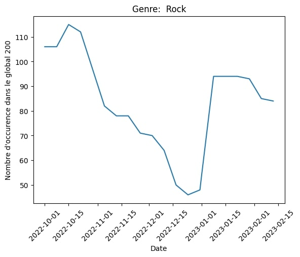

# Projet Billboard-Genius

Ce projet python permet de créer une application dédiée à la musique contenant les données des meilleures chansons au monde, basées sur les ventes numériques et le streaming de plus de 200 pays dans le monde et de montrer l'évolution des tendences au fil du temps

## Présentation du sujet

Pour cela nous avons récuperé par le biais du scraping les données contenues dans deux sites web : 

1) **Billboard** : nous permet de récupérer le classement hebdomadaire des 200 meilleures chansons d'artistes du classement global 200. Dans le classement du Billboard global 200 les données récupérées sont le nom de l'artiste, le titre et des informations liées au rang de la chanson tel que le rang occupé dans semaine actuelle, le meilleur rang atteint et le nombre de semaines que le titre a passé dans le classement.

2) **Genius** : nous permet de récupérer des données plus spécifiques telles que les genres musicaux, les producteurs, les distributeurs et les écrivains du texte.

Pour une meilleure visualisation des données récuperés le scraping est effectué sur une durée de 5 mois.(Il est important de noter que à cause d'une durée d'attente d'environ 2h pour effetuer le scraping dans ça totalité il à été considéré plus judicieux de stocker les données à partir du mois d'octobre 2022 jusqu'au mois de février 2023 dans un fichier csv).
Cependant en dé-commentant les lignes 21 à 361, un scraping en temps réel est éxecuté.

Une fois l’application lancée vous aurez accès aux données de plus de 4000 chansons. Vous pourrez visualiser des données intéressantes concernant l'évolution des tendances au cours du temps ainsi que les genres et distributeurs les dominants le classement.

### Sources de nos données

Billboard Global 200 :  [Billboard.com](https://www.billboard.com/charts/billboard-global-200/).

Genius : [Genius.com](https://genius.com/).

## User Guide 

Ci-dessous les instructions et les précautions nécessaires pour faire tourner l’application dans de bonnes conditions.

### Prérequis 

Vous devez d’abord vous assurer d’avoir la dernière version de Python installée sur votre machine. 
Si ce n’est pas le cas vous pouvez suivre les instructions d'installation [ici](https://www.python.org/downloads/).

Vous devez vous assurer aussi d'avoir Docker installé sur votre machine. Si ce n'est pas le cas vous pouvez le télécharger [ici](https://www.docker.com/products/docker-desktop/)

### Installation 

Assurez-vous d'abord de posséder Git afin de pouvoir cloner le projet à l'aide de la commande suivante à l'aide de Git Bash 

Pour installer l’application effectuer l’instruction suivante : 

    git clone https://github.com/camdore/Billboard-Genius

Placez vous d'abord dans le repertoire approprié avec la commande suivante : 

    cd /path /Billboard-Genius

Pour lancer l'app flask faites cette commande :

    python .\flask_app.py

Nous avons maintenant 3 conteneurs qui se lancent. A la fin de leur build, nous avons une adresse locale qui est :

    http://127.0.0.1:8050/

Veuillez copier coller cette url dans votre navigateur préféré pour pouvoir accéder à notre application Web.

Pour lancer l'app dash faites cette commande :

    python .\dash_app.py  

Veuillez copier coller cette url dans votre navigateur préféré pour pouvoir accéder à notre application Web.
    http://127.0.0.1:8051/
    
## Developper Guide 

### Arbre du projet

    Billboard-Genius/ 

    |-- assets
        |--noel.jpg
        |--hip_pop.jpg
        |--jazz.jpg
        |--rock.jpg

    |-- templates
        index.html

    |-- scrap
    |-- dataframe_finale.csv 
    |-- data_sans_doublons.csv
    |-- dataframe.csv       
    |-- main.py 
    |-- README.md 

### Fonctions des différents fichiers 

### Copyright

On déclare sur l’honneur que le code fourni a été produit par nous même.

## L'application web 

Dans l'application Web, vous pouvez recherchez grâce à la barre de recherche et au filtre à disposition des informations detaillés liés aux artistes, les tistres des chansons, le genres, les distributeurs et les producteurs.(Il faut cependant renseigner le nom exact pour la recherche)

### Conclusion 

La visualisation graphique de la données permet de faire ressortir des nombreuses tendances interessantes liées aux préférences du grand public. 

Ici par exemple on peut voir comment l'arrivée de Noël influence lourdement les habitudes des auditeurs avec une montée en popularité du jazz et des chansons de noël: 

## Link project

https://github.com/camdore/Billboard-Genius

## Auteurs 

Camille Doré, Thomas Ekué Amouzouglo et Adam Lafkih